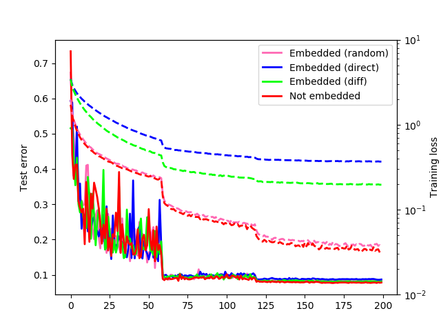

# Embedding Watermarks into Deep Neural Networks
Python implementation of the paper "Embedding Watermarks into Deep Neural Networks" [1] https://arxiv.org/pdf/1701.04082.pdf

<p align="center">
  <br/>
  (Summary of test error and training loss after 200 epochs of training)
</p>

## Libraries and tools
**Visual Studio Code:** a code editor redefined and optimized for building and debugging modern web and cloud applications<br/>
**GPU:** NVIDIA GeForce RTX 2060, for general computing and training the host network<br/>
**CUDA (8.0):** a parallel computing platform and programming model developed by NVIDIA for general computing on graphical processing units (GPUs)<br/>
**NVIDIA cuDNN (5.1):** a GPU-accelerated library of primitives for deep neural networks<br/>
**Keras:** an open-source neural-network library<br/>
**Tensorflow:** a free and open-source software library for dataflow and differentiable programming across a range of tasks. It is a symbolic math library, and is also used for machine learning applications such as neural networks<br/>
**NumPy:** a library for adding support for large, multi-dimensional arrays and matrices, along with a large collection of high-level mathematical functions to operate on these arrays<br/>
**Pandas:** for data manipulation and analysis<br/>

## How to run the code
After you have installed all the libraries above (you need to have a GPU in order to run this code), open a Python terminal and type:
```sh
python main.py config/train_[type of X].json
```
to run the training with the designed type of X parameter which can be: **random**, **diff** and **direct** (for example: train_random.json). The JSON files are configured to train the wide residual network for 200 epochs.

Then, type:
```sh
python utility/wmark_validate.py result/wrn_WTYPE_[type of X]_DIM256_SCALE0.01_N1K4B64EPOCH200_TBLK1.weight result/wrn_WTYPE_[type of X]_DIM256_SCALE0.01_N1K4B64EPOCH200_TBLK1_layer7_w.npy result/[type of X]
```
to extract the embedded watermark. Finally, to visualize the embedded watermark, run:
```sh
python utility/draw_histogram_signature.py config/draw_histogram_[type of X]_non.json hist_signature_non.png
```
and if you want to generate a graphic that summarizes the training of the 200 epochs, just type:
```sh
python utility/draw_history.py config/draw_history.json history.png
```

**Tip:** if you want to run the code without embedding the watermark while training, just add the suffix "_non" at the end of the JSON config files, for example:
```sh
python main.py config/train_[type of X]_non.json
```

## References
[1] Y. Uchida, Y. Nagai, S. Sakazawa, and S. Satoh, "Embedding Watermarks into Deep Neural Networks," ICMR, 2017.<br/>
[2] Original repository: https://github.com/yu4u/dnn-watermark
